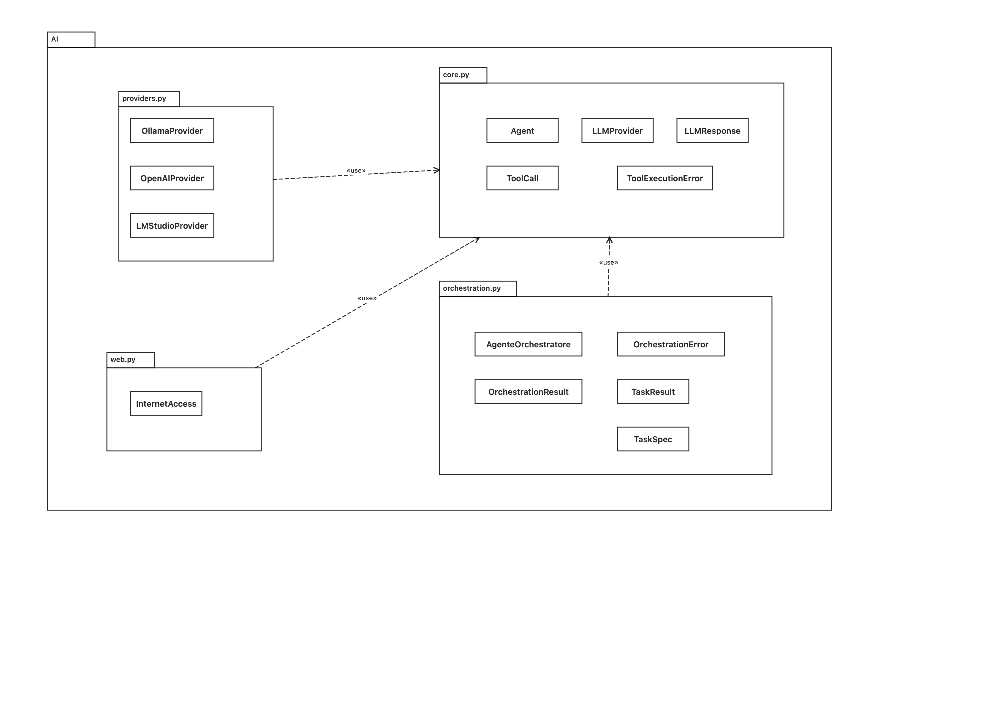
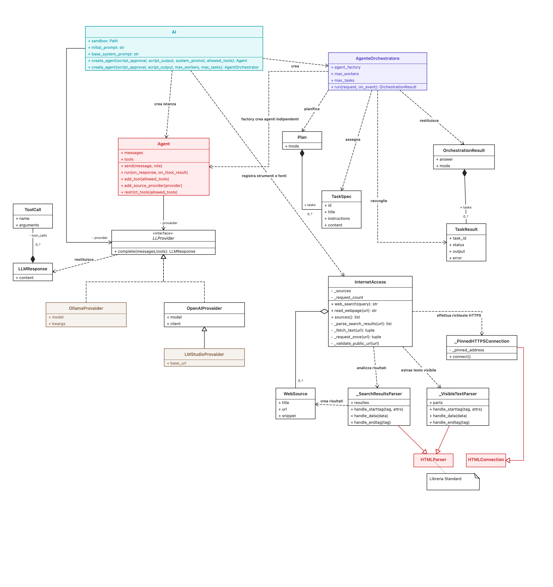

# Agenti IA

Agenti IA è una libreria Python progettata per semplificare lo sviluppo di
agenti basati su modelli di intelligenza artificiale. Fornisce un nucleo per
gestire conversazioni, collegare diversi provider di modelli linguistici,
registrare strumenti utilizzabili dagli agenti e, facoltativamente, lavorare
con file entro una cartella sandbox o consultare pagine web pubbliche.

Il progetto include anche una GUI e una CLI dimostrative, utili come esempi di
integrazione della libreria in applicazioni e strumenti futuri. Attualmente sono configurate per funzionare com LM Studio con il modello "qwen3-4b-2507", quindi è opportuno cambiare il codice per poterlo collegare correttamente al proprio modello remoto/locale.

Il progetto è distribuito con licenza [MIT](./LICENSE).

Per impostazione predefinita l'applicazione usa un modello servito localmente
da **LM Studio**. Il progetto contiene anche provider compatibili con **Ollama**
e con le API **OpenAI**.

## Uso come libreria Python

La GUI e la CLI sono esempi d'applicazione: non sono necessarie per integrare
il nucleo della libreria in un altro programma. Il ciclo minimo si costruisce
importando un provider, creando `Agent`, aggiungendo un messaggio e chiamando
`run()`:

```python
from AI import Agent, LMStudioProvider

provider = LMStudioProvider(model="qwen3-4b-2507")
agent = Agent(
    provider,
    system_prompt="Sei un assistente utile e conciso.",
)
agent.send("Spiega brevemente cosa può fare questa libreria.")
risposta = agent.run()
print(risposta)
```

Per esporre gli strumenti standard di gestione file, passa a `Agent` una
cartella già esistente come `sandbox`:

```python
from AI import Agent, LMStudioProvider

agent = Agent(
    LMStudioProvider(model="qwen3-4b-2507"),
    sandbox="./sandbox",
)
agent.send("Elenca i file disponibili.")
print(agent.run())
```

### Orchestratore multiagente

GUI e CLI usano un agente coordinatore che sceglie tra esecuzione diretta e
decomposizione in attività indipendenti. I worker hanno cronologie separate,
sono avviati con concorrenza limitata e ricevono solo strumenti di lettura;
un agente distinto sintetizza i risultati e segnala le attività non riuscite.
Ogni worker riceve le proprie istruzioni e soltanto l'eventuale contesto
selezionato per quel task, non la cronologia o il contesto degli altri worker.
Se il planner seleziona `direct` ma restituisce anche task, l'app avvisa
l'utente e segue la modalità diretta, ignorando i task incoerenti: questo
evita che un piano incoerente blocchi la richiesta originale.
Quando la richiesta chiede esplicitamente un file, l'app verifica che
`create_file` abbia restituito un esito positivo prima di mostrare la risposta
finale come completata. Se manca, consente un solo tentativo aggiuntivo; se
anche quello fallisce, mostra un errore invece di accettare una dichiarazione
del modello come prova che il file esista.
Dopo una creazione verificata, il riepilogo finale usa il percorso restituito
da `create_file` e non può essere contraddetto da una successiva risposta del
modello.
Per le richieste che combinano ricerca web e creazione di un file, la raccolta
dei risultati e la scrittura sono affidate ad agenti separati: il ricercatore
può usare solo gli strumenti web di lettura e il writer, avviato dopo la ricerca
(e la sintesi nel flusso parallelo), dispone esclusivamente di `create_file`.
Se le fonti non restituiscono dati leggibili, il file segnala il limite
dell'esecuzione corrente senza sostenere che non esistano altre offerte o fonti.
Le richieste che richiedono modifiche a file, script o una singola azione
passano invece al normale agente, che conserva le conferme esplicite già
previste dall'applicazione.

La classe `AI` in `AI/application.py` crea agenti e orchestratori usando
configurazione fornita dal chiamante: un'istanza di `LLMProvider`, il prompt
iniziale e il prompt di sistema. Il provider (e quindi modello, endpoint e
connessione) viene configurato dal chiamante. L'orchestratore si può usare
anche senza GUI:

Il diagramma UML delle classi è disponibile in
[docs/diagramma-classi.md](./docs/diagramma-classi.md).

```python
from AI import AI, LMStudioProvider

INITIAL_PROMPT = "Confronta le informazioni nei documenti."
DEFAULT_MODEL = "nome-modello-esposto-dal-server"
_BASE_SYSTEM_PROMPT = "Sei un assistente utile."
provider = LMStudioProvider(
    model=DEFAULT_MODEL,
    base_url="http://localhost:1234/v1",
)

app = AI(
    provider,
    "./sandbox",
    initial_prompt=INITIAL_PROMPT,
    base_system_prompt=_BASE_SYSTEM_PROMPT,
)
orchestrator = app.create_orchestrator(max_workers=2)
result = orchestrator.run(
    "Confronta le date, i costi e i rischi descritti nei documenti."
)
print(result.answer)
for task in result.tasks:
    print(task.task_id, task.status, task.error or "")
```

`max_workers` è compreso tra 1 e 4; il numero di task pianificati è limitato a
5. La concorrenza effettiva dipende dal runtime locale e dalle risorse
disponibili, quindi più worker non garantiscono risposte più rapide. Entrambe
le interfacce accettano una sola richiesta utente alla volta: il parallelismo
riguarda i worker della singola richiesta, non conversazioni persistenti.

Il codice commentato di `AI/core.py`, `AI/providers.py` e `AI/web.py` descrive
le API riutilizzabili; `agente_gui.py` e `agente.py` mostrano come integrarle
rispettivamente in un'interfaccia grafica e in un terminale. Per aggiungere un
provider, implementa `LLMProvider.complete()` restituendo `LLMResponse`; per
aggiungere strumenti, registra funzioni con `Agent.add_tool()`.

## Funzionalità e limiti

- Elenca file, cerca e legge testo, estrae informazioni, confronta documenti e
  individua attività nella sandbox.
- Può creare file, aggiungere testo e spostare o rinominare file **solo
  all'interno della sandbox**. La creazione non sovrascrive file esistenti;
  se un nome è già occupato, l'agente riceve l'errore e può riprovare con un
  nome diverso.
- Dalla GUI può eseguire script Bash richiesti dall'utente, ma solo dopo aver
  mostrato il codice esatto e averne ricevuto l'approvazione. Lo script viene
  scritto in un'area temporanea, eliminata al termine o se l'esecuzione è
  annullata. L'output standard e gli errori appaiono nella console della GUI.
- Può cercare sul web con DuckDuckGo e leggere il testo visibile di pagine
  pubbliche. Le richieste web sono solo HTTPS GET: niente login, moduli,
  caricamenti o download. Se una pagina restituisce un errore HTTP (per
  esempio `403 Forbidden`), l'errore viene mostrato e passato al modello come
  esito di quella singola lettura; l'agente può continuare con le altre fonti
  e indicare quali non erano accessibili.
  Se DuckDuckGo non restituisce risultati leggibili, vengono tentati entrambi
  i layout supportati; se il motore presenta una verifica anti-automazione o
  un limite temporaneo, viene segnalato esplicitamente come tale invece di
  apparire come una ricerca con zero risultati.
- Le ricerche web inviano la query a DuckDuckGo. Non inserirvi informazioni
  private, credenziali o contenuti della sandbox. I risultati web sono
  contenuti non attendibili; l'agente li tratta come fonti e aggiunge le
  citazioni alla risposta.
- Il log GUI separa gli eventi in blocchi: ogni intestazione mostra un'icona,
  data e ora locale, agente e strumento quando pertinente; la descrizione
  dell'attività segue su una riga indentata.
- La CLI usa lo stesso formato a blocchi per richiesta, risposte intermedie,
  risultati degli strumenti e risposta finale.
- Il progetto non include un modello linguistico: occorre installare e avviare
  un provider compatibile (vedi [Configurazione del modello](#configurazione-del-modello)).

## Requisiti

- Python **3.10 o successivo**.
- `pip` e `venv` (normalmente distribuiti con Python).
- La libreria Python `openai` (`>=1.0,<3`), installata da
  `requirements.txt`. È usata dal provider predefinito LM Studio e da quello
  OpenAI; non richiede una chiave OpenAI quando si usa LM Studio.
- Una connessione Internet per installare la libreria e per gli strumenti web.
- **Tkinter**, incluso nella maggior parte delle distribuzioni Python ma
  talvolta da installare separatamente, se si vuole avviare la GUI.
- LM Studio (modalità predefinita), Ollama oppure accesso a un endpoint OpenAI,
  secondo il provider scelto.

Tkinter fa parte della libreria standard Python: non si installa con `pip`.
Per verificare se è disponibile:

```bash
python -c "import tkinter; print('Tkinter disponibile')"
```

Su Debian/Ubuntu, se manca, installare il pacchetto di sistema corrispondente,
ad esempio `sudo apt install python3-tk`. Su macOS usare una distribuzione di
Python che includa Tcl/Tk (per esempio quella ufficiale di python.org) oppure
installare il componente Tkinter corrispondente alla versione Python usata.
Su Windows selezionare Tcl/Tk nel programma di installazione di Python, se non
è già presente.

## Installazione

Clonare il repository o scaricarne una copia e aprire un terminale nella
cartella del progetto.

### macOS e Linux

```bash
python3 -m venv .venv
source .venv/bin/activate
python -m pip install --upgrade pip
python -m pip install -r requirements.txt
```

### Windows (PowerShell)

```powershell
py -3 -m venv .venv
.\.venv\Scripts\Activate.ps1
python -m pip install --upgrade pip
python -m pip install -r requirements.txt
```

Se PowerShell impedisce l'attivazione dello script, si può usare il prompt dei
comandi:

```bat
.venv\Scripts\activate.bat
```

Non è necessario attivare l'ambiente virtuale se si invoca direttamente il suo
interprete. Per esempio, su macOS/Linux:
`.venv/bin/python -m pip install -r requirements.txt`; su Windows:
`.venv\Scripts\python.exe -m pip install -r requirements.txt`.

## Configurazione del modello

### LM Studio (predefinito)

1. Installare LM Studio e scaricare un modello compatibile con le tool call.
   Il codice usa per impostazione predefinita il nome `qwen3-4b-2507`.
2. Caricare il modello e avviare il server API locale di LM Studio, normalmente
   all'indirizzo `http://localhost:1234/v1`.
3. Se il nome del modello caricato o l'indirizzo del server sono diversi,
   passare il nome del modello desiderato al costruttore `AI`:

   ```python
   provider = LMStudioProvider(
       model="nome-modello-esposto-dal-server",
       # base_url="http://localhost:1234/v1",
   )
   ```

   `base_url` è facoltativo se si usa l'indirizzo predefinito. Il client locale
   non richiede una chiave API. Verificare che server e modello siano avviati
   prima di inviare una richiesta.

### Ollama (alternativa locale)

Installare e avviare Ollama, scaricare un modello, ad esempio con
`ollama pull qwen3:4b`, quindi installare il client opzionale:

```bash
python -m pip install ollama
```

In `agente.py`, importare `OllamaProvider` da `AI` e sostituire la riga che crea
`LMStudioProvider` con:

```python
provider = OllamaProvider(model="qwen3:4b")
```

`ollama` non è elencato in `requirements.txt` perché serve solo scegliendo
questo provider.

### API OpenAI (alternativa remota)

Impostare `OPENAI_API_KEY` nell'ambiente senza scriverla nel codice o
versionarla. Poi in `agente.py`, importare `OpenAIProvider` da `AI` e usare:

```python
provider = OpenAIProvider(model="gpt-4o-mini")
```

Le richieste al modello in questa modalità vengono inviate al servizio remoto
OpenAI. Non è necessario modificare o configurare questa opzione quando si usa
LM Studio.

## Avvio

Dalla cartella principale, con l'ambiente virtuale attivo:

```bash
python agente_gui.py
```

La finestra permette di scegliere la cartella sandbox, scrivere una richiesta
e inviarla con il pulsante o con **Ctrl+Invio**. La sandbox predefinita è
`sandbox/` nella cartella del progetto. Il pulsante **Info strumenti** descrive
le azioni disponibili e le relative cautele; la tabella degli agenti mostra in
tempo reale pianificatore, worker e sintetizzatore con un indicatore colorato
per stato. Se l'agente propone di eseguire uno
script Bash, la GUI mostra il contenuto completo e avvisa che lo script opera
con i privilegi dell'utente corrente; si può approvare o annullare. Lo script
temporaneo e i file temporanei destinati al comando vengono eliminati al
termine. Non viene richiesta né memorizzata una password amministrativa.

Per l'avvio da terminale:

```bash
python agente.py
```

La CLI chiede la richiesta nel terminale. Se l'agente vuole eseguire uno
script Bash, mostra il codice completo e attende che l'utente digiti
`ESEGUI`; qualsiasi altro input o la fine dell'input annulla l'esecuzione.
L'output dei comandi appare in tempo reale nel terminale. Se Tkinter non è
disponibile, l'avvio CLI non ne ha bisogno.

## Cartella sandbox e dati

La sandbox delimita i file accessibili agli strumenti dell'agente. La GUI
consente di selezionare un'altra cartella; la CLI usa `sandbox/` per
impostazione predefinita. I controlli sui percorsi impediscono di leggere o
modificare file al di fuori della cartella selezionata.

La sandbox **non isola i processi Bash**: uno script approvato può accedere a
qualsiasi file o risorsa di rete consentiti all'utente che avvia l'applicazione.
Il codice dello script viene memorizzato temporaneamente fuori dalla sandbox;
l'approvazione mostra il codice che sarà eseguito, ma non è un'analisi che ne
garantisce la sicurezza. Per questo controllare attentamente il codice e gli
obiettivi di rete prima di autorizzare. Gli script sono limitati a 64 KiB; dopo
120 secondi viene terminato il gruppo di processi avviato dallo script e i log
sono limitati a 1 MiB. L'area temporanea viene rimossa al termine, in caso di
errore o di annullamento. Processi che lo script avvia in background o scollega
possono però continuare a funzionare. Gli script non vengono eseguiti se
l'applicazione è avviata come root. La funzione Bash è disponibile dalla GUI
e dalla CLI interattiva su macOS e Linux.

`sandbox/note.txt` è un piccolo file di esempio. I contenuti della sandbox
sono dati dell'utente, non dipendenze del programma. `.gitignore` esclude i
file della sandbox dal versionamento, così come gli ambienti virtuali non
vengono versionati; conservare separatamente i dati importanti.
In alcune copie locali può essere presente anche
`sandbox/lista_proposte_di_lavoro.txt`: è un dato ignorato da Git e non è
garantito che sia disponibile dopo una nuova clonazione.

## Test

Con l'ambiente virtuale attivo, eseguire dalla radice del repository:

```bash
python -m unittest discover -s tests -v
```

I test non richiedono un modello in esecuzione né chiamate reali al web: le
risposte di rete e del modello sono simulate nei test.

## Struttura dei file

```text
.
├── agente.py
├── agente_gui.py
├── requirements.txt
├── AI/
│   ├── __init__.py
│   ├── core.py
│   ├── orchestration.py
│   ├── providers.py
│   └── web.py
├── sandbox/
│   └── note.txt
├── tests/
│   ├── test_agent_tools.py
│   ├── test_app_orchestration.py
│   ├── test_gui_agent_status.py
│   ├── test_orchestration.py
│   └── test_web_access.py
└── .vscode/
    ├── launch.json
    └── settings.json
```

### File del progetto

- [`agente.py`](./agente.py): punto d'ingresso CLI; contiene
  `main()`, che configura la factory `AI` con le impostazioni della CLI.
- [`agente_gui.py`](./agente_gui.py): punto d'ingresso GUI Tkinter; contiene la
  classe `AgentGUI`, che costruisce la finestra, avvia l'agente in un thread
  e mostra risposte, azioni ed errori.
- [`requirements.txt`](./requirements.txt): dipendenze Python richieste dal
  provider configurato (`openai`).
- [`AI/__init__.py`](./AI/__init__.py): espone le classi pubbliche del package
  (`Agent`, `AgentOrchestrator`, i modelli di risultato, `InternetAccess`,
  `LLMProvider`, `LLMResponse`, `ToolCall` e i provider).
- [`AI/core.py`](./AI/core.py): logica di conversazione e strumenti sandbox.
- [`AI/orchestration.py`](./AI/orchestration.py): modelli dei task, validazione
  del piano e coordinamento limitato di pianificatore, worker e sintetizzatore.
- [`AI/application.py`](./AI/application.py): factory `AI`, parametrizzata
  dai chiamanti, per agenti e orchestratore applicativo.
- [`AI/providers.py`](./AI/providers.py): adattatori per i diversi servizi
  linguistici.
- [`AI/web.py`](./AI/web.py): ricerca e lettura web in sola lettura.
- [`sandbox/note.txt`](./sandbox/note.txt): esempio di testo utilizzabile
  dall'agente. Altri file in `sandbox/` sono dati locali e possono variare da
  installazione a installazione.
- [`tests/test_agent_tools.py`](./tests/test_agent_tools.py): test degli
  strumenti sandbox, dei limiti dei percorsi e degli schemi tool.
- [`tests/test_orchestration.py`](./tests/test_orchestration.py): test di
  validazione dei piani, limiti di concorrenza, isolamento, ordinamento e
  gestione dei fallimenti.
- [`tests/test_app_orchestration.py`](./tests/test_app_orchestration.py):
  verifica la factory applicativa e la creazione di agenti indipendenti con la
  stessa configurazione.
- [`tests/test_gui_agent_status.py`](./tests/test_gui_agent_status.py): verifica
  le transizioni di stato e gli indicatori per agenti e task nella GUI.
- [`tests/test_web_access.py`](./tests/test_web_access.py): test dei parser
  web, della validazione delle query/URL, dei limiti di rete e
  dell'integrazione con l'agente.
- [`.gitignore`](./.gitignore): esclude bytecode Python e file della sandbox
  dal versionamento.
- [`.vscode/launch.json`](./.vscode/launch.json): configurazioni di debug
  VS Code per GUI e CLI. In VS Code selezionare come interprete quello
  dell'ambiente `.venv`.
- [`.vscode/settings.json`](./.vscode/settings.json): indica `python3` come
  interprete predefinito suggerito per VS Code.
- `Puoi`: file vuoto presente nel repository; non contiene codice e non è
  usato dall'applicazione.
- `__pycache__/`, `AI/__pycache__/` e `tests/__pycache__/`: cartelle di
  bytecode Python generate dagli avvii e dai test. Non sono sorgenti né
  dipendenze; Python le rigenera quando necessario.

### Classi e componenti Python



#### `AI/core.py`

- `ToolCall`: nome e argomenti di una funzione richiesta dal modello.
- `LLMResponse`: testo restituito dal modello e, se presenti, chiamate agli
  strumenti.
- `LLMProvider`: interfaccia base; i provider implementano `complete(...)`.
- `ToolExecutionError`: errore esplicito di uno strumento che viene riportato
  al modello come risultato, così può proseguire senza considerare riuscita
  l'operazione fallita.
- `Agent`: gestisce cronologia, strumenti, sandbox e ciclo delle tool call.
  `send(...)` aggiunge un messaggio e `run(...)` interroga il provider ed
  esegue gli strumenti disponibili. Con una sandbox registra:
  `list_files`, `search_text`, `read_file_excerpt`, `create_file`,
  `append_to_file`, `move_file`, `extract_information`, `compare_files` e
  `prepare_tasks`. Una allowlist opzionale limita gli strumenti registrati;
  `restrict_tools(...)` consente solo di restringere ulteriormente l'accesso.
  Le azioni possono essere sostituite con callback tramite il parametro
  `actions`.

#### `AI/orchestration.py`

- `TaskSpec`, `TaskResult` e `OrchestrationResult`: dati immutabili per
  descrivere attività, esiti e risposta complessiva.
- `AgentOrchestrator`: valida il JSON del planner, esegue task indipendenti
  in un pool limitato e raccoglie i risultati nell'ordine originale. I worker
  non condividono istanze o cronologie e sono limitati a strumenti in sola
  lettura.
- `OrchestrationError`: errore esplicito per piani invalidi e sintesi assente.

#### `AI/providers.py`

- `OllamaProvider`: comunica con Ollama tramite il suo client Python e
  converte gli strumenti negli schemi attesi dal servizio.
- `OpenAIProvider`: usa l'API Chat Completions compatibile con OpenAI;
  permette di fornire un client oppure `base_url` e `api_key`.
- `LMStudioProvider`: specializzazione di `OpenAIProvider` preconfigurata
  sull'endpoint locale di LM Studio.


#### `AI/web.py`

- `WebSource`: rappresenta titolo, URL e snippet di un risultato.
- `_SearchResultsParser`: parser HTML interno per i risultati DuckDuckGo.
- `_VisibleTextParser`: parser interno che estrae il testo visibile ed esclude
  script e contenuti non visibili.
- `_PinnedHTTPSConnection`: connessione HTTPS interna che usa l'indirizzo
  pubblico già validato.
- `InternetAccess`: espone `web_search(...)`, `read_webpage(...)` e
  `sources()`. Limita query, dimensione delle pagine, reindirizzamenti e
  richieste; rifiuta indirizzi non pubblici, protocolli diversi da HTTPS e
  contenuti non HTML.
- `_contains_sensitive_data(...)`, `_sanitize_text(...)` e
  `_unwrap_search_url(...)`: funzioni interne per rilevare dati sensibili,
  sanificare testo e validare/estrarre URL dai risultati.



#### `agente_gui.py` e test

- `AgentGUI`: interfaccia grafica; metodi interni costruiscono i controlli,
  validano l'input, avviano l'agente e aggiornano la finestra in modo sicuro.
- `DummyProvider` e `AgentToolsTests` in `tests/test_agent_tools.py`:
  provider simulato e test degli strumenti dell'agente.
- `DummyProvider` e `WebAccessTests` in `tests/test_web_access.py`: provider
  simulato e test dell'accesso web e del relativo comportamento nell'agente.
