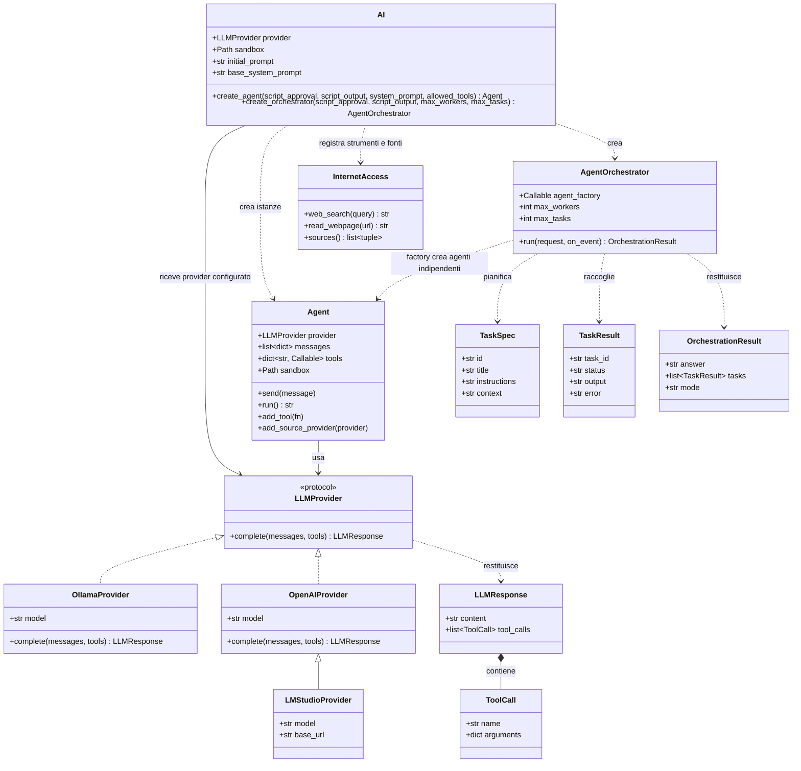

# Diagramma UML delle classi

Il diagramma mostra le classi principali del package `AI` e le relazioni
utilizzate durante la creazione e l'orchestrazione degli agenti.

`AI` condivide la stessa istanza di provider tra gli agenti creati per una
richiesta; ogni `Agent` mantiene invece messaggi, strumenti e fonti per il
proprio contesto. Di conseguenza, un provider passato a `AI` deve poter
gestire chiamate concorrenti quando l'orchestratore esegue più worker in
parallelo.
